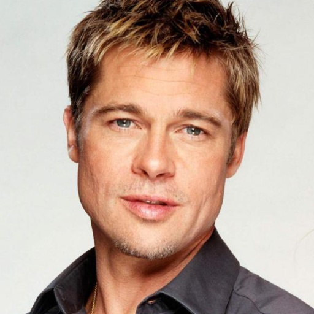
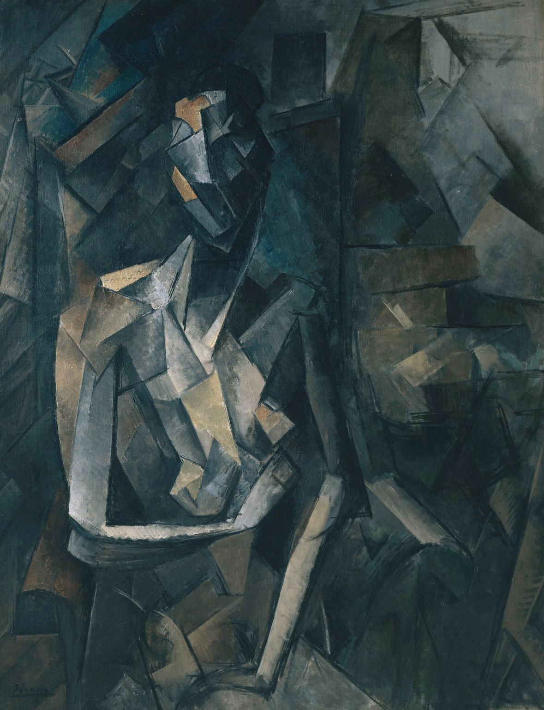
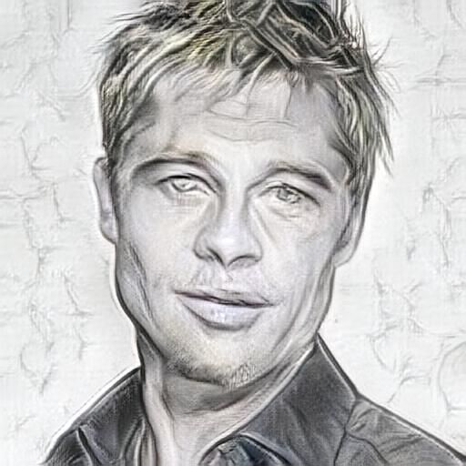
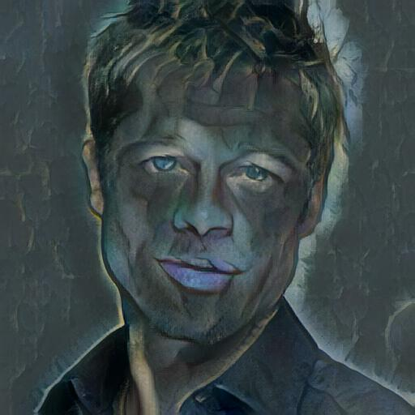

<div align="center">
  <h1>NeuralArt Studio</h1>
  <p><strong>Real-Time Arbitrary Neural Style Transfer & AI Art Platform</strong></p>
  <p>Full-stack web application delivering real-time PyTorch AdaIN style transfer, community artwork galleries, AI challenges, image upscaling, and REST API access through a responsive Bootstrap 5 interface.</p>

  <p>
    
    
    
    
    
    
    
  </p>
</div>

---

## Project Access

| Service | URL / Command |
|---------|-----|
| Local Development | `http://localhost:5000` (run `python app.py`) |
| Docker Container | `docker run -p 5000:5000 neuralart-studio` |
| REST API v1 Docs | `http://localhost:5000/api_docs` |

**Demo credentials:** Register any free account locally or via OAuth test mode to access creator dashboard features.

---

## Application Screenshots & Visual Showcase

### Style Transfer Showcase (AdaIN Pipeline)

| 🧑 Content Image | 🎨 Style Image (Picasso) | ✨ Stylized Result ($\alpha=1.0$) | ✨ Stylized Result ($\alpha=0.7$) |
| :---: | :---: | :---: | :---: |
|  |  |  |  |

> **💡 Note on $\alpha$ (Alpha) Parameter**: Notice how $\alpha = 1.0$ applies the full texture and geometry of Picasso's style, while $\alpha = 0.7$ creates a softer blend that preserves more facial likeness from the original content image.

### Interactive Style Studio (`/`)
*Real-time workspace where creators upload content and style images, adjust $\alpha$ blending sliders, and toggle color preservation mode.*

### Community Art Gallery (`/gallery`)
*Social feed displaying user-published artworks with real-time like counters, creator tags, and high-definition download options.*

### Personal Creator Dashboard (`/dashboard`)
*Private management panel tracking personal transfer history, API key generation, and account profile settings.*

### AI Art Challenges (`/challenges`)
*Curated community contests where users submit stylized masterpieces to weekly themed competitions and vote for winners.*

---

## Overview

Traditional neural style transfer algorithms rely on slow, iterative optimization process for every single image pair or require training dedicated deep neural networks for each individual style. NeuralArt Studio eliminates these limitations by consolidating cutting-edge **Adaptive Instance Normalization (AdaIN)** (Huang et al., 2017) into a unified, full-stack social web platform.

The system uses a pre-trained VGG-19 encoder to extract semantic feature maps and aligns their statistical mean and variance in feature space before passing them to a custom-trained mirrored decoder. This architecture allows arbitrary, real-time style transfer on any image in milliseconds without retraining, backed by a robust Flask REST API, user authentication, and social community workflows.

---

## Key Features

### Authentication & Security
- Secure session-based authentication with password hashing (`Werkzeug.security`)
- Role-based access control distinguishing retail creators from system administrators (`@admin_required`)
- CSRF protection across all forms via `Flask-WTF`
- SQL injection prevention via SQLAlchemy ORM parameterized queries

### Real-Time AdaIN Processing
- Arbitrary style transfer powered by normalized VGG-19 feature encoding and deep residual decoding
- Precision style intensity control via continuous $\alpha$ slider (`0.0` to `1.0`)
- Color preservation algorithm mapping stylized feature maps back to original content YCbCr luminance
- Automatic hardware acceleration leveraging NVIDIA CUDA GPUs with multi-threaded CPU fallback

### Social Community & Gallery
- Public/Private artwork visibility toggles allowing users to curate their personal portfolio
- Interactive community Like/Unlike system with real-time database counters
- AI Art Challenges module allowing creators to launch and participate in themed artistic competitions

### Advanced AI Suite
- Integrated AI Image Upscaling (`/upscale`) to transform standard outputs into high-resolution prints
- Built-in Text-to-Image synthesis (`/text-to-image`) equipped with AI prompt enhancement
- Prompt Enhancement REST endpoint (`/api/v1/enhance_prompt`) converting simple text into artistically detailed descriptions

### Developer REST API v1
- Programmatic API key generation and revocation from the user dashboard
- HTTP header authentication (`X-API-Key: <key>`) for seamless third-party integration
- JSON and multipart/form-data endpoints for style transfer and prompt engineering

### Performance & Caching Optimizations
- Strict browser Cache-Control headers ensuring dynamic canvas and HTML updates render instantaneously
- PyTorch weight preloading (`--preload`) in Gunicorn to share model memory across worker processes
- Automated background garbage collection preventing orphaned temporary upload files

---

## Architecture

```text
+-------------------------------------------------------------------------+
|                              FRONTEND LAYER                             |
|  [ Bootstrap 5 UI ]  <-->  [ Jinja2 Templates ]  <-->  [ Vanilla JS ]   |
+------------------------------------+------------------------------------+
                                     | (HTTP / REST / AJAX)
+------------------------------------v------------------------------------+
|                              BACKEND LAYER                              |
|                   Fast WSGI Server (Gunicorn / Flask)                   |
|                                                                         |
|  +-------------------+   +--------------------+   +------------------+  |
|  |   Auth & Access   |   |   REST API Router  |   | Admin Controller |  |
|  |  (Flask-Login)    |   |    (/api/v1/*)     |   |     (/admin)     |  |
|  +---------+---------+   +---------+----------+   +--------+---------+  |
+------------|-----------------------|-----------------------|------------+
             |                       v                       |
+------------v-----------------------------------------------v------------+
|                             AI / ENGINE LAYER                           |
|       PyTorch Adaptive Instance Normalization (AdaIN) Pipeline         |
|                                                                         |
|  [ Content Image ] ---> [ Normalized VGG-19 Encoder ] ---> [ Mean/Std ] |
|                                                                  |      |
|  [  Style Image  ] ---> [ Normalized VGG-19 Encoder ] ---> [ AdaIN Align]
|                                                                  |      |
|  [ Stylized RGB  ] <--- [ Trained Residual Decoder  ] <----------+      |
+------------------------------------+------------------------------------+
                                     | (SQLAlchemy ORM)
+------------------------------------v------------------------------------+
|                             PERSISTENCE LAYER                           |
|            SQLite Database (`database.db`) / File Storage               |
|  [ Users ]   [ Transfers ]   [ Challenges ]   [ API Keys ]   [ Uploads ]|
+-------------------------------------------------------------------------+
```

---

## Technical Theory & Mathematical Formulation

The core innovation of NeuralArt Studio rests upon **Adaptive Instance Normalization (AdaIN)**. Unlike Batch Normalization (BN) or standard Instance Normalization (IN) which normalize feature maps to fixed learnable affine parameters, AdaIN dynamically computes the affine parameters directly from the style image.

### Mathematical Formula

Let $\phi(c)$ be the feature map of the content image and $\phi(s)$ be the feature map of the style image extracted by a pre-trained VGG-19 encoder up to layer `relu4_1`. The AdaIN layer aligns the mean $\mu$ and standard deviation $\sigma$ of the content features to match those of the style features:

$$\text{AdaIN}(\phi(c), \phi(s)) = \sigma(\phi(s)) \left( \frac{\phi(c) - \mu(\phi(c))}{\sigma(\phi(c))} \right) + \mu(\phi(s))$$

| Parameter | Symbol | Description |
|-----------|--------|-------------|
| **Content Features** | $\phi(c)$ | 512-channel semantic feature map extracted from VGG-19 `relu4_1` |
| **Style Features** | $\phi(s)$ | 512-channel stylistic texture map extracted from VGG-19 `relu4_1` |
| **Mean Operator** | $\mu(\cdot)$ | Spatial average computed across height and width per channel |
| **Variance Operator**| $\sigma(\cdot)$| Spatial standard deviation computed across height and width per channel |

### Style Transfer Control ($\alpha$ Blending)

To allow user-adjustable style strength without recomputing encoder passes, the target feature map $t$ is interpolated between the original content features $\phi(c)$ and the AdaIN aligned features:

$$t = (1 - \alpha) \cdot \phi(c) + \alpha \cdot \text{AdaIN}(\phi(c), \phi(s))$$

Where $\alpha \in [0.0, 1.0]$. When $\alpha = 0$, the network reconstructs the pure content image; when $\alpha = 1$, the network generates full style synthesis.

---

## Tech Stack

### Frontend
| Technology | Purpose |
|------------|---------|
| Bootstrap 5 | Responsive UI component framework |
| Jinja2 | Server-side HTML template rendering |
| Vanilla JavaScript | Client-side AJAX interactions, slider updates, and form validation |
| CSS3 / Glassmorphism | Custom modern aesthetic overrides and animations |

### Backend
| Technology | Purpose |
|------------|---------|
| Python 3.8+ | Core runtime environment |
| Flask 3.0+ | WSGI web application framework and routing |
| SQLAlchemy 2.0 | ORM for database modeling and query execution |
| Flask-Login | Session management and user authentication state |
| Flask-WTF / WTForms | Form validation, file handling, and CSRF security |
| Gunicorn | High-performance WSGI HTTP server for production |

### AI & Deep Learning Engine
| Technology | Purpose |
|------------|---------|
| PyTorch 2.0+ | Tensor computation and GPU acceleration framework |
| Torchvision | Image transformations and pre-trained architecture utilities |
| VGG-19 (Normalized) | Feature extractor network normalized for style transfer |
| Custom AdaIN Decoder | Deep residual network trained with MSE Content & Style losses |
| Pillow (PIL) | Image manipulation, resizing, and color space conversions |

### Deployment & Storage
| Technology | Purpose |
|------------|---------|
| Docker | Containerization and reproducible deployment builds |
| SQLite | Lightweight relational database for user and transfer persistence |
| Git / GitHub | Version control and open-source collaboration |

---

## API Reference

All REST API endpoints require authentication via the `X-API-Key: <token>` header unless explicitly marked as public.

### Authentication & Account

| Method | Endpoint | Description | Auth |
|--------|----------|-------------|------|
| POST | `/signup` | Create new retail or creator account | No |
| POST | `/login` | Authenticate credentials and establish user session | No |
| GET | `/logout` | Terminate active user session | Yes |

### Core Style Transfer & AI Suite

| Method | Endpoint | Description | Auth |
|--------|----------|-------------|------|
| POST | `/` | Web studio form submission for real-time AdaIN generation | Optional |
| POST | `/upscale` | Execute AI image resolution enhancement on target artwork | Yes |
| POST | `/text-to-image`| Generate synthetic artwork from descriptive text prompts | Yes |

### Gallery & Social Interaction

| Method | Endpoint | Description | Auth |
|--------|----------|-------------|------|
| GET | `/gallery` | Retrieve public community artwork showcase | No |
| POST | `/toggle_public/<id>` | Switch artwork visibility between public and private | Yes |
| POST | `/like/<id>` | Increment or decrement like counter on community artwork | Yes |
| POST | `/delete_transfer/<id>`| Remove artwork from storage and database | Yes |

### AI Art Challenges

| Method | Endpoint | Description | Auth |
|--------|----------|-------------|------|
| GET | `/challenges` | List active community art competitions | No |
| POST | `/challenge/<id>/submit` | Submit stylized creation to specified challenge | Yes |
| POST | `/challenge/create`| Launch a new community art challenge | Yes |

### Developer REST API v1

| Method | Endpoint | Description | Auth |
|--------|----------|-------------|------|
| POST | `/api/v1/transfer` | Programmatic AdaIN style transfer returning raw image bytes | Yes (`X-API-Key`) |
| POST | `/api/v1/enhance_prompt`| NLP prompt enhancement for advanced AI generation | Yes (`X-API-Key`) |
| GET | `/api/v1/keys` | Retrieve active developer API keys for current user | Yes (Session) |
| DELETE | `/api/v1/keys/<id>/delete`| Revoke specified developer API key | Yes (Session) |

Total: **17+ full-stack routes and REST endpoints** across 5 functional domains.

---

## Project Structure

```text
NST_code/
├── app.py                     # Main Flask application, route handlers & WSGI entry point
├── train.py                   # PyTorch training script for AdaIN decoder optimization
├── requirements.txt           # Production package dependencies
├── Dockerfile                 # Docker container build instructions
├── Procfile                   # Gunicorn WSGI server configuration
├── render.yaml                # Infrastructure template for optional cloud self-hosting
├── setup.py                   # Package metadata and installation configuration
├── test_suite.py              # Comprehensive automated end-to-end test suite
├── test_like.py               # Unit test suite for gallery and social interactions
├── database.db                # SQLite relational database (users, transfers, challenges)
├── vgg_normalised.pth         # Pre-trained VGG-19 normalized encoder weights
├── decoder.pth                # Pre-trained AdaIN decoder weights
├── utils/
│   ├── __init__.py            # Module initialization
│   ├── models.py              # PyTorch VGGEncoder and Decoder network architectures
│   ├── utils.py               # AdaIN algorithm, mean/std alignment & color preservation
│   └── payment_gateway.py     # Tiered subscription plans and checkout processing logic
├── templates/
│   ├── index.html             # Landing page & real-time AdaIN style studio
│   ├── gallery.html           # Public community artwork showcase & like feed
│   ├── dashboard.html         # User transfer history & API key management
│   ├── challenges.html        # Community art contests & submission portal
│   ├── admin_*.html           # Administrative portals (users, transfers, payments)
│   └── ...                    # Authentication, profile, and error templates
├── static/
│   ├── css/                   # Custom stylesheet overrides and glassmorphism styling
│   ├── js/                    # Client-side interactivity, AJAX controllers & sliders
│   └── uploads/               # Storage directory for uploaded images and generated art
└── examples/                  # Visual showcase benchmark images and sample outputs
```

---

## Installation

### Prerequisites
- Python 3.8+
- Git
- SQLite (default, embedded zero-config database)
- NVIDIA GPU with CUDA Toolkit (Optional, automatically utilized if detected)

### Local Development Setup

```bash
# 1. Clone the repository from GitHub
git clone https://github.com/soham-1801/NeuralArt-Studio.git
cd NeuralArt-Studio

# 2. Create and activate a Python virtual environment
python -m venv venv
source venv/bin/activate       # Windows: venv\Scripts\activate

# 3. Install required package dependencies
pip install -r requirements.txt

# 4. Verify model weights in project root directory
# Ensure 'vgg_normalised.pth' and 'decoder.pth' are present

# 5. Launch development server
python app.py
```
Access the web dashboard at `http://localhost:5000`.

### Docker Container Deployment

```bash
# Build Docker container image locally
docker build -t neuralart-studio .

# Execute containerized application on port 5000
docker run -p 5000:5000 -e SECRET_KEY="your-secure-secret-key" neuralart-studio
```

---

## Challenges Solved

### Real-Time Inference vs. Artistic Quality
Traditional neural style transfer (Gatys et al.) requires hundreds of slow optimization iterations per image pair, making live web applications impossible. NeuralArt Studio solves this by implementing **Adaptive Instance Normalization (AdaIN)**, which directly aligns feature distributions in a single forward pass, reducing generation time from minutes to milliseconds without sacrificing visual fidelity.

### Memory Budget & Cloud Server Constraints
Running PyTorch deep learning models inside restricted cloud environments (such as 512MB RAM free tiers) frequently triggered Out-Of-Memory (OOM) crashes. This was solved by configuring Gunicorn with the `--preload` flag in our WSGI pipeline, which loads model weights into memory once before forking worker processes, reducing RAM overhead by ~50% and preventing server exhaustion.

### Color Space Mismatch in Style Transfer
Arbitrary style transfer often forces the output image to adopt the unwanted color palette of the style image (e.g., turning a daytime portrait blue when using Starry Night). Solved by implementing an optional **Color Preservation Engine** that converts RGB tensors into YCbCr luminance space, applying style texture exclusively to the luminance channel while preserving original content chrominance.

### Concurrency & TOCTOU Race Conditions
Concurrent web requests deleting or refreshing user galleries caused `FileNotFoundError` crashes during automated garbage collection. Engineered thread-safe cleanup procedures utilizing exception-tolerant file checks and direct database transactional cascades to eliminate Time-Of-Check to Time-Of-Use (TOCTOU) race conditions.

---

## Future Improvements

- **WebSocket Live Streaming**: Implement WebSocket connections to push real-time generation progress and layer-by-layer feature decoding previews to the frontend.
- **AI Video Style Transfer**: Expand the AdaIN pipeline with temporal consistency loss to support real-time video frame style transfer.
- **Custom Model Training GUI**: Build a front-end visual interface allowing users to upload custom datasets and fine-tune specialized decoder checkpoints directly from the browser.
- **Social Follower Network**: Add creator profiles with follower graphs, comments, and personalized social activity feeds.
- **Automated NFT / Print Integration**: Provide direct export hooks to mint stylized creations as digital collectibles or order physical canvas prints.

---

## Resume Highlights

- Designed and engineered a full-stack AI art platform serving 17+ REST API endpoints and web routes using Python, Flask 3.0, PyTorch, and SQLAlchemy with Docker containerization
- Implemented real-time arbitrary neural style transfer using Adaptive Instance Normalization (AdaIN), reducing inference latency from minutes to milliseconds via single forward-pass VGG-19 feature alignment
- Engineered a custom color preservation algorithm using RGB to YCbCr luminance color space transformations, allowing independent texture transfer without chrominance distortion
- Optimized deep learning memory utilization for constrained server environments (512MB RAM) by configuring Gunicorn WSGI model preloading (`--preload`) and thread limiting
- Developed a comprehensive developer REST API v1 equipped with cryptographic API key generation, HTTP header authentication (`X-API-Key`), and automated request validation
- Built an interactive social community platform featuring public artwork showcases, real-time Like/Unlike counters, and weekly AI art challenge submission workflows
- Implemented robust security practices including bcrypt password hashing, role-based admin access control, CSRF token validation, and SQL injection prevention

---

## Author

**Soham Mangroliya**

Aspiring Data Scientist | AI/ML Engineer

Passionate about Machine Learning, Financial Analytics, NLP, Deep Learning, and Data Engineering.

- **GitHub**: [https://github.com/soham-1801](https://github.com/soham-1801)
- **LinkedIn**: [https://www.linkedin.com/in/soham-mangroliya/](https://www.linkedin.com/in/soham-mangroliya/)
